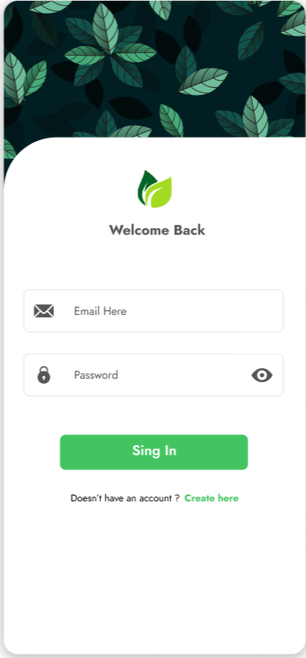
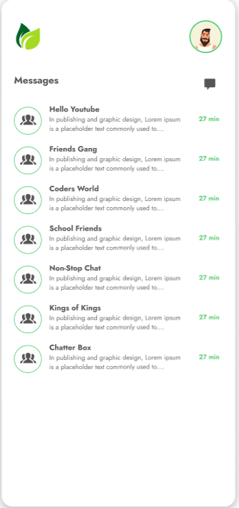
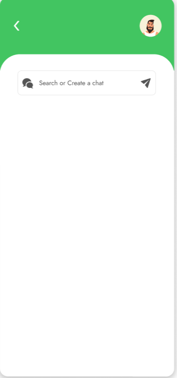
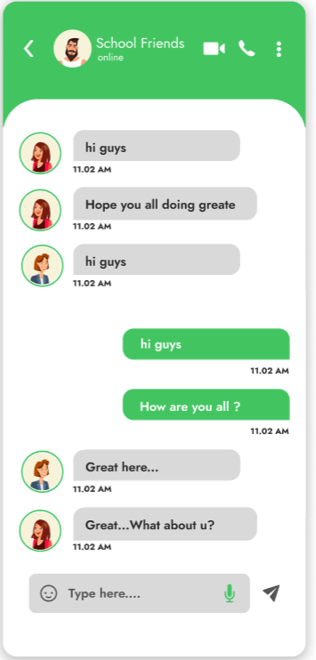
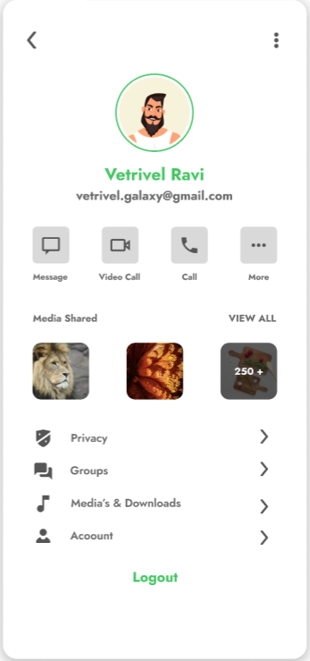
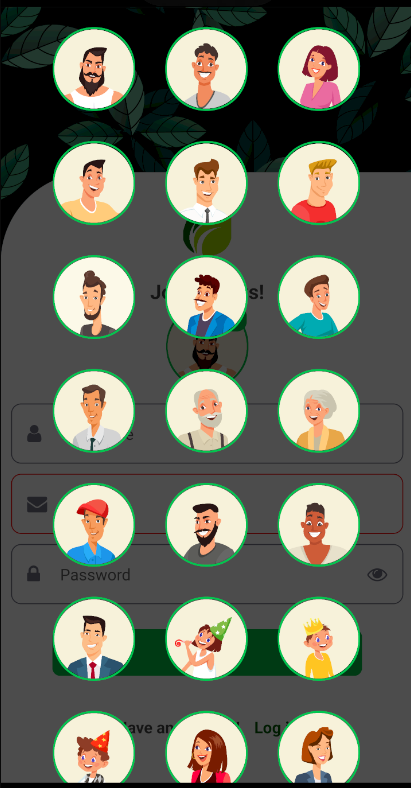

# Chat App

ChatApp is a simple and elegant chat application built with React Native and Firebase. It allows users to sign up, log in, and chat with their friends in real-time.
The app used Redux as it is global state management. and uses server timestamp to determine the massage time. 

# Table of Contents  
[Screenshots](#screenshots)  
[Features](#Features)  
[Installation](#Installation)  
[Usage](#Usage)  
[Dependencies](#Dependencies)   
[Contact](#Contact)  
<a name="Screenshots"/>
<a name="Features"/>
<a name="Installation"/>
<a name="Usage"/>
<a name="Dependencies"/>
<a name="Contact"/>

## Screenshots

 
  
 
 
 
 

## Features
* User authentication (Sign Up and Sign In)
* Real-time messaging using Firebase Firestore
* Clean and user-friendly interface
* Remember the User when trying to open the app after the first sign in
* Choosing Avatar

## Installation
This is a new [**React Native**](https://reactnative.dev) project, bootstrapped using [`@react-native-community/cli`](https://github.com/react-native-community/cli).

>**Note**: Make sure you have completed the [React Native - Environment Setup](https://reactnative.dev/docs/environment-setup) instructions till "Creating a new application" step, before proceeding.

## Step 1: Start the Metro Server

First, you will need to start **Metro**, the JavaScript _bundler_ that ships _with_ React Native.

To start Metro, run the following command from the _root_ of your React Native project:

```bash
# using npm
npm start

# OR using Yarn
yarn start
```

## Step 2: Start your Application

Let Metro Bundler run in its _own_ terminal. Open a _new_ terminal from the _root_ of your React Native project. Run the following command to start your _Android_ or _iOS_ app:

### For Android

```bash
# using npm
npm run android

# OR using Yarn
yarn android
```

### For iOS

```bash
# using npm
npm run ios

# OR using Yarn
yarn ios
```

If everything is set up _correctly_, you should see your new app running in your _Android Emulator_ or _iOS Simulator_ shortly provided you have set up your emulator/simulator correctly.

## Usage
* Open the application.
* Sign up for a new account or log in with your existing credentials.
* Start chatting with your friends!

## Dependencies
* React Native
* Firebase
* react-native-firebase
* Vector-Icons
* Redux
* React-navigation
* Native-stack
## Contact
Mohammad Jamal Malash
+972568961396
mohammadmalashcarrer@gmail.com
